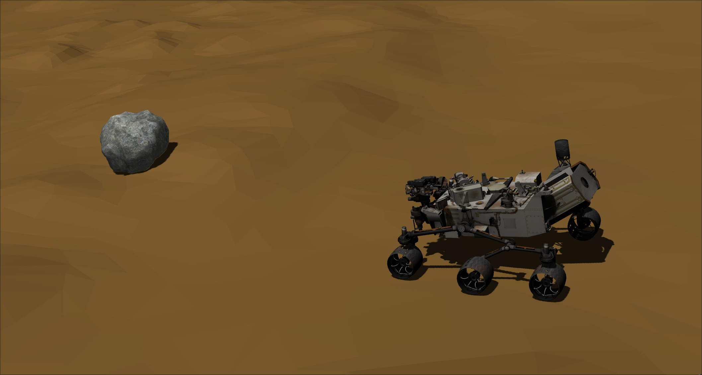

# Curiosity rover and simple Mars world

## Overview
This is my fork of curiosity mars rover ROSject from 
[this repository](https://bitbucket.org/theconstructcore/curiosity_mars_rover/src/master/curiosity_mars_rover_description/).
This package contains urdf model of NASA's Curiosity rover and a simple Mars world with rocks.
I've moved this package to ROS noetic, attached lidar to the rover and added several rocks on Mars terrain.
Be aware that lidar is located at an awkward spot. You probably want to change its location in *xacro* file.

## Dependencies
1. Relies on [velodyne_simulator](https://bitbucket.org/DataspeedInc/velodyne_simulator/src/master) 
for lidar simulation.
2. Rover depends on several additional controllers:
    * ros-noetic-joint-state-controller
    * ros-noetic-effort-controllers
    * ros-noetic-joint-trajectory-controller
    * ros-noetic-position-controllers
    * ros-noetic-velocity-controller

## Quick start
1. Run `catkin_make` in your *catkin_ws*
2. Source your *catkin_ws*
3. Launch this package: `roslaunch curiosity_mars_rover_description main_real_mars_path.launch`

## Licensing
Original project didn't have license in it, but it was
[mentioned](https://discourse.ros.org/t/the-nasa-curiosity-rover-rosject-is-now-open-source/7635) that it's free to use and modify.
If you are from Construct and want this repository to be removed contact me via email please.
